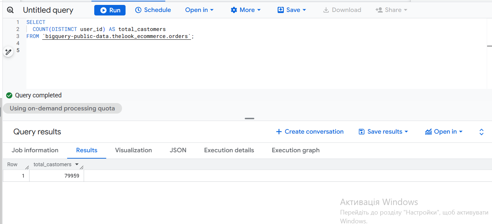
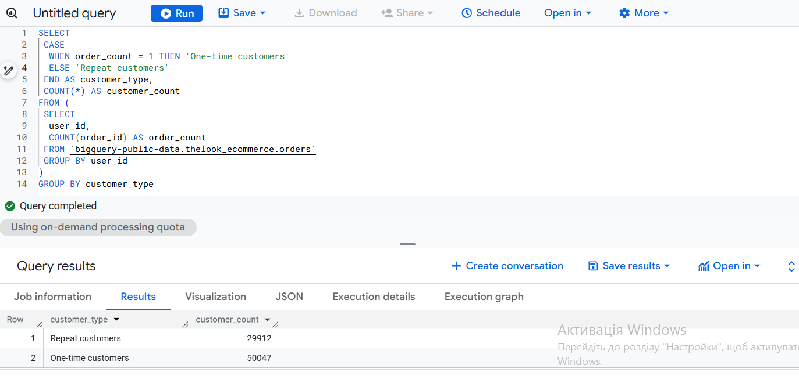
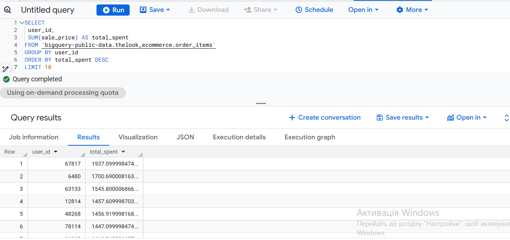

# Customer Analysis with SQL

## Project Overview
This project focuses on analyzing customer data using SQL.
The goal is to understand customer activity, revenue metrics, and identify top customers.

## Dataset
The dataset includes customer-level transactional data such as:
- customer ID
- purchase activity
- revenue information

## Key Metrics
- Total number of customers
- Number of active customers
- ARPU (Average Revenue Per User)
- Top 10 customers by revenue

## Results

### Total Customers

### Active Customers

### ARPU

### Top 10 Customers

## Tools
- SQL
- GitHub

## Conclusion
This project demonstrates practical SQL skills for customer analytics and portfolio purposes.
